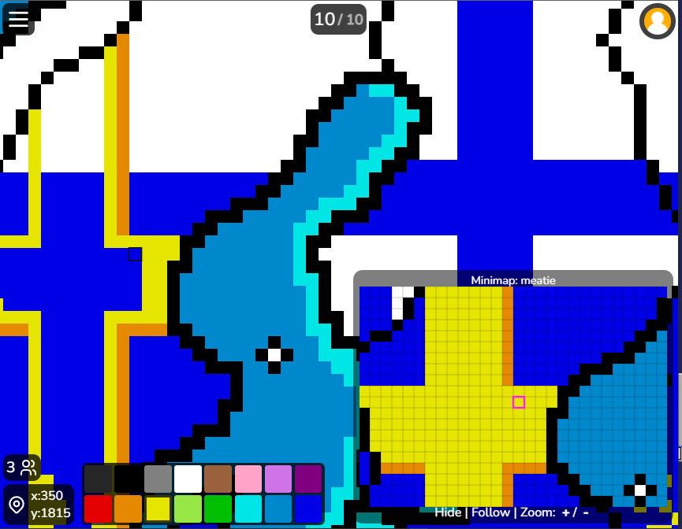

# pixel-minimap

## Keys:

QERTYUIOP and FGHJKLZ: Select color

space: Hide / show.  Important: We start up with minimap hidden.

+/-: Zoom the minimap

Instructions

Use Tampermonkey plugin to inject this into the game. Add a script, paste in the code.

Images and the template list (templates.json, or templates/data.json) need to be on a https: server.
Github is possibly the easiest option, if you get the Github windows client for updating it.
Use Commit from your local folder, followed by "Push origin".

Template images should be png, 16 color with correct PZ palette. To get this palette, open any of the template png's in this folder and save the color palette from it.

On first run, the script asks for template location. This is a folder with png images, and the file templates.json, which lists them and assigns size and coordinates. This input stores in a cookie. You don't need to change the path in the script. You can also change it in console:
setCookie("baseTemplateUrl", "https://template-path-here/")

The template folder by default has no subfolders. It can have subfolders, "images" and "templates", if you change:
var subfolders = true;

With setting subfolders=false, path for the image is same as the json.
But you can also give a full image URL to other sites in the "name" property.

Demo

